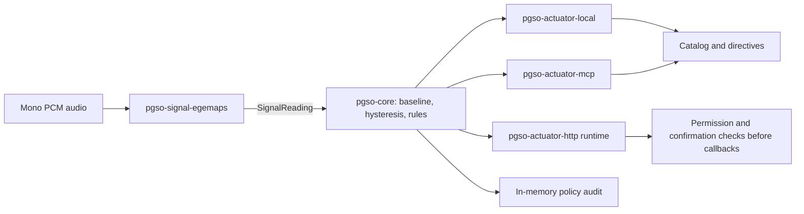

# PGSO — Paralinguistic Governance for State Orchestration

[](https://github.com/PGSO-Workspace/pgso-sdk/actions/workflows/ci.yml)
[](#requirements-and-verification)
[](LICENSE)

PGSO is an experimental Rust SDK for studying how acoustic observations can inform
an agent's tool policy. A signal extractor maps audio to numerical readings; a
stateful decision engine evaluates deviations from a reference baseline; rules
translate sustained deviations into catalog restrictions, confirmation requirements,
or removable context directives. The reference extractor uses acoustic features
without automatic speech recognition.

The research hypothesis is that such policy adaptation may improve interaction
outcomes under suitable conditions. The implementation and its regression tests
establish software behavior within specified boundaries. They do not establish
emotion recognition, improved empathy, comparative agent performance, or safety
in deployment. Experimental provenance and reproduction instructions are collected
in the [reproducibility package](experiments/reproducibility/README.md).
The [operational measurement report](experiments/reproducibility/operational-results-7805fb9.md)
compares four persistent integrations on one host and reports diagnostic receipt
checks; developer effort and human interaction outcomes remain unmeasured.

## Architecture

The `Signal` and `Actuator` traits separate perception from policy application.
`pgso-core` depends on `thiserror` and the Rust standard library; the decision
engine reads caller-supplied timestamps and does not consult a clock or random
number generator. Its output depends on the reading sequence, configuration,
rules, and prior state. Agreement across build profiles on one host does not
establish cross-platform bitwise reproducibility.



| Crate | Implemented role |
|---|---|
| [`pgso-core`](crates/pgso-core) | Reading types, decision engine, rules, governance state, audit records, and pipeline |
| [`pgso-signal-egemaps`](crates/pgso-signal-egemaps) | Pure Rust, eGeMAPS-style acoustic descriptors and a heuristic arousal mapping |
| [`pgso-actuator-local`](crates/pgso-actuator-local) | Reference catalog and directive management in memory |
| [`pgso-actuator-mcp`](crates/pgso-actuator-mcp) | MCP catalog representation and tool-list change notification support |
| [`pgso-actuator-http`](crates/pgso-actuator-http/README.md) | Experimental authenticated HTTP/MCP dispatch runtime with host permissions and confirmations |

The HTTP runtime is implemented. Its MCP endpoint uses JSON responses and requires
clients to refresh `tools/list`; it does not implement SSE or server notifications.
A neural `pgso-signal-onnx` adapter remains planned and is not a workspace crate.

## Perception and policy semantics

The reference extractor computes pitch, energy, jitter, shimmer, and voicing
features. Its `confidence` field is a voicing-quality heuristic, not a calibrated
probability of emotion or an appropriate governance action. An acoustic deviation
alone does not identify tension, frustration, or intent. Thresholds and the
initial baseline require validation for the intended population and recording
conditions.

The [sustained-governance contract](docs/governance-contract.md) defines the current
engine and pipeline behavior:

| Observation or host action | Policy behavior |
|---|---|
| Valid deviation below the engine threshold | Update the baseline and retire that axis's contributions |
| Valid deviation at or above the threshold | Freeze the baseline; count same-side observations; reconcile matching rules after hysteresis is satisfied |
| Deviation changes side | Restart hysteresis; retain existing policy while pending |
| Invalid, low-confidence, or backward-timestamp reading | Hold baseline, hysteresis, and effective policy |
| No readings or silence | Hold policy; no automatic time advancement or permission restoration |
| Accepted-reading gap exceeds an optional limit | Reset hysteresis before processing the new observation; the gap alone does not restore permissions |
| Explicit host expiry | Retire stale contributions and reconcile those that remain |
| Failed actuator reconciliation | Return an error without committing the reading's engine state; the actuator must leave served state unchanged |

Here, *nominal* means below a numerical threshold, not a judgment that a person is
calm. Engine and rule thresholds are separate gates. Rule direction selects
`Rising`, `Falling`, or `Either`; the `pgso_rules!` macro uses the legacy `Either`
behavior. Use `Rule::with_direction` when direction matters.

Protected tools cannot be pruned by the reference governance state. The rule
engine downgrades an attempted protected-tool prune to `RequireStepUp`; unprotected
tools can still be pruned. Step-up is therefore a policy choice rather than a
universal default. The [protected-catalog argument](docs/protected-catalog-argument.md)
states the assumptions behind this property.

## Execution boundary and audit limits

Catalog filtering changes what the agent is shown. It does not itself prevent
execution through another route. The local and MCP catalog adapters therefore
require a host-enforced execution boundary when tools have effects.

The HTTP runtime checks host permissions, current policy, schemas, and applicable
confirmation tokens immediately before dispatching callbacks. A trusted host
issues confirmations after independently obtaining consent. Integrations must
keep tool credentials and alternative execution routes outside the model's
control. See the [HTTP integration guide](crates/pgso-actuator-http/README.md) for
authentication, clock, session, and confirmation requirements.

Context directives are maintained separately from the base prompt and removed
when their contributions retire. Policy changes carry audit records, including
the requested action before protected-tool enforcement. Execution receipts include
bounded reason codes and the committed policy-history prefix length for
diagnosis. Audit logs and execution
receipts are in memory; the host must persist them. Failed policy commits are
returned as errors and require separate host logging. Restoring a catalog does
not reverse an already executed tool's effects.

## Quick start

From a repository checkout, run the synthetic acoustic example:

```sh
cargo run -p pgso-signal-egemaps --example extract
```

This example requires no model download and illustrates feature extraction, not
validated emotion recognition. For a separate binary crate located beside the
checkout, use these local dependencies in its `Cargo.toml` (adjust the paths if
necessary):

```toml
[dependencies]
pgso-core = { path = "../pgso-sdk/crates/pgso-core" }
pgso-signal-egemaps = { path = "../pgso-sdk/crates/pgso-signal-egemaps" }
pgso-actuator-local = { path = "../pgso-sdk/crates/pgso-actuator-local" }
```

The following complete `src/main.rs` constructs a policy and processes one second
of silence. It is a wiring example; silence should not activate the rule. The
numerical settings are illustrative and are not calibrated recommendations.

```rust
use std::collections::HashSet;

use pgso_actuator_local::LocalActuator;
use pgso_core::{
    Action, AudioWindow, Axis, Catalog, DecisionEngine, Direction, EngineConfig,
    Pgso, Rule, RuleEngine, RuleSet, Tool, ToolId,
};
use pgso_signal_egemaps::EgemapsSignal;

fn main() -> Result<(), Box<dyn std::error::Error>> {
    let protected = HashSet::from([ToolId::from("escalate")]);
    let catalog = Catalog::new(vec![
        Tool::new("submit_order", "Submit order"),
        Tool::new("escalate", "Escalate to a human"),
    ]);
    let rules = RuleSet::new(vec![Rule::new(
        "rising_arousal_confirmation",
        Axis::Arousal,
        0.3,
        0.6,
        vec![Action::RequireStepUp(ToolId::from("submit_order"))],
    )
    .with_direction(Direction::Rising)]);
    let engine = DecisionEngine::try_new(EngineConfig {
        confidence_threshold: 0.5,
        deviation_threshold: 0.3,
        hysteresis_window: 3,
        ema_alpha: 0.1,
        warmup_readings: 5,
        population_prior: 0.5,
    })?
    .with_max_gap_ms(2_000)?;

    let mut pgso = Pgso::builder()
        .signal(EgemapsSignal::new(16_000))
        .engine(engine)
        .rules(RuleEngine::new(rules, protected.clone()))
        .actuator(LocalActuator::new(catalog, protected))
        .build()?;
    let window = AudioWindow {
        samples: vec![0.0; 16_000],
        sample_rate: 16_000,
        timestamp_ms: 0,
    };
    let served = pgso.process_window(&window)?;
    println!("{served:?}");
    Ok(())
}
```

For real input, supply finite normalized mono PCM at the extractor's configured
sample rate and consistent timestamps. The extractor has no residual streaming
buffer, so the host must frame audio consistently. Equivalent reading sequences
have batch-independent policy state; arbitrary audio chunkings are not asserted
to produce equivalent readings. Use the HTTP runtime or another audited host
boundary to enforce step-up at execution time.

## Requirements and verification

The workspace declares Rust 1.83 as its minimum supported Rust version. CI checks
the library build on 1.83 and runs tests and linting on stable; development
dependencies may require a newer Cargo. From the repository root:

```sh
cargo build --workspace --locked
PROPTEST_RNG_SEED=20260914 cargo test --workspace
PROPTEST_RNG_SEED=20260914 cargo test --workspace --release
cargo fmt --all -- --check
cargo clippy --workspace --all-targets -- -D warnings
RUSTDOCFLAGS='-D warnings' cargo doc --workspace --no-deps
cargo +1.83.0 build --workspace --locked
```

The [CI workflow](.github/workflows/ci.yml) defines the automated checks. The
[verification ledger](docs/validation/2026-09-14-verification.json) records a
specific verification run, including mutation and build-profile trace checks.
Regression and sampled property tests support the stated implementation contract;
they are not proofs of all integrations or empirical validation of the signal.

## Experimental status and reproduction

The repository contains historical experimental harnesses alongside the SDK.
Their presence does not establish that all underlying data, model versions,
predictions, or result artifacts are available. The
[reproducibility package](experiments/reproducibility/README.md) identifies the
available material, required inputs, and remaining gaps. Consult it before
interpreting a historical report or attempting to reproduce a result.

Open empirical questions include signal validity on spontaneous speech, policy
threshold selection, robustness to speaker and recording variation, and effects
on interaction outcomes. Slow ramps can be absorbed by baseline adaptation;
freezing outlying observations does not solve cumulative change detection.
Speaker-change detection and a trusted baseline-calibration dataset are not
provided. Lexical–prosodic discrepancy is a future hypothesis rather than an
implemented input to the current acoustic pipeline.

## License and citation

Licensed under the [MIT License](LICENSE) © 2026 Lucio Yen.

If you use PGSO in academic work, cite the project and record the commit used:

```bibtex
@software{pgso_sdk,
  title  = {PGSO: Paralinguistic Governance for State Orchestration},
  author = {Yen, Lucio},
  year   = {2026},
  url    = {https://github.com/PGSO-Workspace/pgso-sdk}
}
```

The [matched lifecycle and dispatch comparison](experiments/reproducibility/README.md#matched-lifecycle-and-dispatch-comparison) evaluates actual PGSO, NeMo, and Invariant integrations against a shared finite contract. The [human pilot procedure](experiments/reproducibility/pilot-procedure.md) describes the separate, prospective conversational evaluation.
