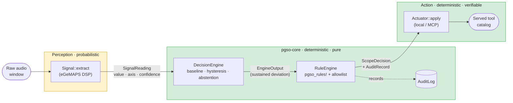
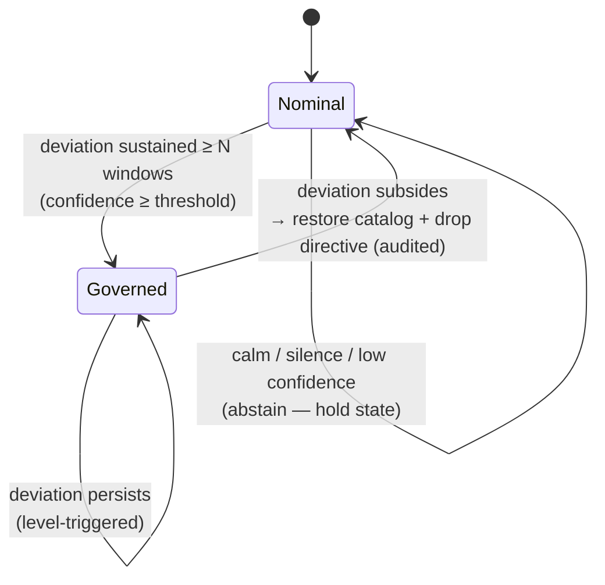
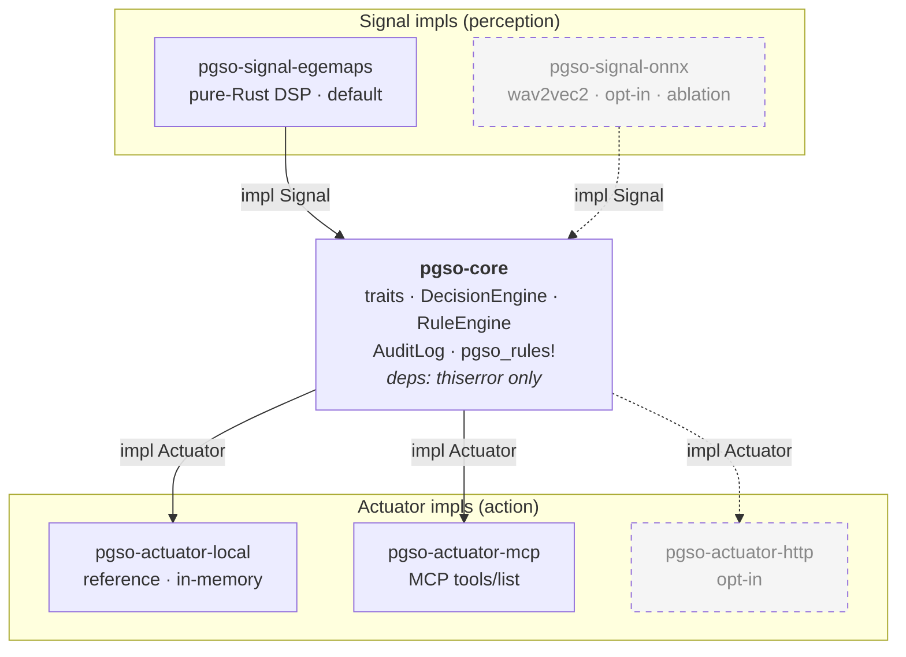

<div align="center">

# PGSO — Paralinguistic Governance for State Orchestration

### *Better Agents by Listening*

A Rust SDK that gives an agent **ears**: it perceives **how** something is said — pitch, energy, jitter, rhythm — directly from raw audio (no ASR), and uses that paralinguistic signal to **deterministically govern which tools the agent's catalog exposes**.

[](https://github.com/Kochi-sicem/pgso-sdk/actions/workflows/ci.yml)
[](#minimum-supported-rust-version)
[](LICENSE)

</div>

---

## Table of contents

- [The idea](#the-idea)
- [What PGSO is — and is not](#what-pgso-is--and-is-not)
- [How it works](#how-it-works)
- [Architecture](#architecture)
- [Safety guarantees](#safety-guarantees)
- [Quick start](#quick-start)
- [Crate layout](#crate-layout)
- [Building, testing, and quality gates](#building-testing-and-quality-gates)
- [Project status & roadmap](#project-status--roadmap)
- [Design principles (invariants)](#design-principles-invariants)
- [License & citation](#license--citation)

---

## The idea

Today's agents respond identically to *"I'm interested"* said with enthusiasm and said with irritation: they read the **words** and are **deaf to the tone**. Their personality — fixed in the system prompt — never adapts. A "patient, consultative" seller stays patient even when it should hear the frustration and change.

**PGSO makes an agent's personality contingent on the paralinguistic channel.** By giving it ears, the personality stops being static text and becomes *text + a repertoire of capabilities that modulates with how the interlocutor sounds.*

> The perception is **probabilistic** (a signal with a confidence). The action is **deterministic** (verifiable code). **Uncertainty lives in the perception; the guarantee lives in the action.** If a tool is not exposed, the model cannot call it — that part is not a guess.

---

## What PGSO is — and is not

|  | |
|---|---|
| ✅ **Is** | An *external* governance layer that perceives the paralinguistic channel and deterministically governs an agent's tool catalog. |
| ✅ **Is** | Auditable: every intervention is traceable and reversible. |
| ❌ **Is not** | A model, an orchestrator, or middleware living *inside* the agent. |
| ❌ **Is not** | An emotion detector exposed as a product. |
| ❌ **Is not** | A system that rewrites the prompt or blocks tools punitively. |

---

## How it works

The interlocutor speaks; PGSO takes raw audio in parallel with the agent. A **probabilistic** perception stage feeds a **deterministic** governance core, which decides — verifiably — what the agent's catalog exposes.



1. **Perceive** — `Signal::extract` turns an audio window into a `SignalReading` (a normalized paralinguistic value on an axis, plus a calibrated confidence). The default extractor is pure-Rust DSP (eGeMAPS-style low-level descriptors), so each reading is **explainable** — *"pitch rose, energy fell vs. baseline."*
2. **Decide** — the `DecisionEngine` tracks a three-layer speaker baseline (population prior → warm-up mean → EMA), requires the deviation to be **sustained** (hysteresis, so a lone spike never fires), and **abstains** below a confidence threshold.
3. **Rule** — a sustained deviation triggers compile-time `pgso_rules!`, which emit `ScopeDecision`s. The **inviolable allowlist** is enforced here: a `Prune` of a protected tool is downgraded to `RequireStepUp`, never dropped.
4. **Act** — the `Actuator` applies the decision to the served catalog. When the signal returns to nominal, the catalog is **restored** and any appended directive removed — and the reversal is recorded in the `AuditLog`.

> **Non-punitive by default.** A false positive costs *one clarifying step-up*, never an unjust block.

### Governance lifecycle



---

## Architecture

The core is **pure and deterministic** and exposes exactly **two symmetric extension boundaries** — `Signal` (perception, swappable) and `Actuator` (action, swappable). The core never reaches outward; adapters and extractors plug in behind the traits and call into it.



**Independence.** The reference actuator is owned and minimal (`pgso-actuator-local`). MCP/HTTP are *optional adapters behind the same `Actuator` trait* — you plug them in only if you audit and want them. You never depend on a black box; the trait keeps you sovereign. The same is true for the signal source.

> **Agnosticism is demonstrated, not asserted:** the MCP adapter and a second mock signal were both added with a **zero-line diff to `pgso-core`**.

---

## Safety guarantees

These are structural properties enforced by the core and verified by tests (including property tests) — not configuration.

| | Guarantee | Enforced by |
|---|---|---|
| **G1** | **Base prompt is sovereign** — never rewritten; only a demarcated, removable directive block is appended, removed on return to nominal. | Actuator `Allow` restore |
| **G2** | **Inviolable allowlist** — protected tools are *never* pruned, for *any* signal sequence. | RuleEngine downgrade + both actuators; **property test `prop_allowlist_never_pruned`** |
| **G3** | **Non-punitive by default** — escalate friction (`RequireStepUp`), not removal. | RuleEngine |
| **G4** | **Abstention on low confidence** — below threshold, hold state, emit nothing. | DecisionEngine |
| **G5** | **Full auditability** — every intervention *and* reversal is traceable and reversible. | `AuditLog` / `AuditRecord` |

> **Governing principle: PGSO fails toward inaction, not intervention.**

---

## Quick start

```toml
# Cargo.toml
[dependencies]
pgso-core = { path = "crates/pgso-core" }
pgso-signal-egemaps = { path = "crates/pgso-signal-egemaps" }  # default DSP signal
pgso-actuator-local = { path = "crates/pgso-actuator-local" }  # reference actuator
```

```rust
use std::collections::HashSet;
use pgso_core::{
    pgso_rules, Action, Catalog, DecisionEngine, EngineConfig, Pgso, RuleEngine, Tool, ToolId,
};
use pgso_actuator_local::LocalActuator;
use pgso_signal_egemaps::EgemapsSignal;

// 1. Declare a contingent-personality rule at compile time.
//    "On sustained vocal tension, stop pushing the close and clarify."
let rules = pgso_rules! {
    rule "tense_arousal" {
        axis: Arousal,
        deviation: 0.4,
        confidence: 0.6,
        action: Action::RequireStepUp(ToolId::from("close_sale")),
        action: Action::InjectDirective("Tension detected — clarify, don't push.".into())
    }
};

// 2. Declare the catalog and the inviolable allowlist (G2).
let protected = HashSet::from([ToolId::from("escalate")]);
let catalog = Catalog::new(vec![
    Tool::new("search", "Web Search"),
    Tool::new("close_sale", "Close Sale"),
    Tool::new("escalate", "Escalate to Human"), // protected — never pruned
]);

// 3. Wire perception → deterministic core → action.
let mut pgso = Pgso::builder()
    .signal(EgemapsSignal::new(16_000)) // 16 kHz mono audio
    .engine(DecisionEngine::new(EngineConfig {
        confidence_threshold: 0.5,
        deviation_threshold: 0.3,
        hysteresis_window: 3,   // a lone spike never fires
        ema_alpha: 0.1,
        warmup_readings: 5,
        population_prior: 0.5,
    }))
    .rules(RuleEngine::new(rules, protected.clone()))
    .actuator(LocalActuator::new(catalog, protected))
    .build()?; // returns Result — never panics on a missing stage

// 4. Stream audio windows as the conversation unfolds.
//    `served` is the catalog the agent is allowed to see this turn.
let served = pgso.process_window(&window)?;
```

Run the auditable default-signal demo (no model download, CPU-only):

```bash
cargo run -p pgso-signal-egemaps --example extract
```

---

## Crate layout

| Crate | Role | Status |
|---|---|---|
| **`pgso-core`** | Pure deterministic core: `Signal`/`Actuator` traits, `DecisionEngine`, `RuleEngine` + `pgso_rules!`, `AuditLog`, generic `Pgso<S, A>` pipeline. **Depends only on `thiserror`.** | ✅ |
| **`pgso-signal-egemaps`** | Default signal: pure-Rust DSP extractor (F0, energy, jitter, shimmer, voicing) — lightweight, auditable, no model. | ✅ |
| **`pgso-actuator-local`** | Reference actuator; in-memory; the G2 backstop. | ✅ |
| **`pgso-actuator-mcp`** | Model Context Protocol adapter (`tools/list` + `notifications/tools/list_changed`). | ✅ |
| `pgso-signal-onnx` | wav2vec2 (`ort`) neural extractor — opt-in, for DSP-vs-neural ablation. | ⏳ planned |
| `pgso-actuator-http` | HTTP/Olive-pattern adapter. | ⏳ planned |

---

## Building, testing, and quality gates

```bash
cargo build --workspace
cargo test  --workspace                              # 63 tests across 13 suites
cargo clippy --workspace --all-targets -- -D warnings
cargo doc   --workspace --no-deps                    # warning-free; #![deny(missing_docs)]
cargo bench -p pgso-signal-egemaps                   # signal latency p50/p95/p99
```

Enforced in [CI](.github/workflows/ci.yml) on every push and PR:

- **`rustfmt`** — `cargo fmt --check`
- **`clippy`** — `-D warnings` (default lint set, incl. `incompatible_msrv`)
- **`test`** — full workspace test suite
- **`doc`** — `RUSTDOCFLAGS=-D warnings` (enforces `#![deny(missing_docs)]`)
- **MSRV job** — build-verified on Rust **1.83** (the full test suite runs on stable; a transitive dev-dependency needs a newer Cargo to test)

Quality posture: **0 `unsafe`**, **0 panics in library code** (`Result` + `thiserror` throughout), library code **`clippy::pedantic` + `nursery` clean**, **100% public-API documentation**, deterministic decision path (no clock, no RNG).

### Minimum Supported Rust Version

**1.83** — declared in `[workspace.package]` and verified by the CI `msrv` job.

---

## Project status & roadmap

The complete proof-of-concept is implemented and verified: a paralinguistic signal deterministically governs an agent's tool catalog, with G1–G5 holding end-to-end and transport/signal agnosticism demonstrated.

- [x] **M1** — Local actuator (the controllable exposure point)
- [x] **M2** — Deterministic core (engine, rules, allowlist invariant)
- [x] **M3** — Paralinguistic signal (eGeMAPS DSP, default, auditable)
- [x] **M4** — End-to-end wiring (the PoC: prosody alters the catalog)
- [x] **M5** — Transport agnosticism (MCP adapter + mock signal, empty-core-diff proof)
- [ ] **M6** — Domain validation on real spontaneous speech (AI sellers) — *empirical; the next scientific milestone*
- [ ] Hardening: `GovernedCatalog` extraction (de-dup actuators), `pgso-signal-onnx` ablation crate, opt-in Python/Node bindings

> **Scope honesty:** v1 is **prosody-only**. The *say–hear discrepancy* (lexical vs. prosodic) is a future hypothesis, not a v1 premise — a Phase-0 calibration placed it in a "gray zone" (AUC 0.661) on acted speech, so v1 ships the strong prosodic signal and reincorporates discrepancy as a hypothesis to test in real-domain validation. See [`docs/`](docs/) for the PRD, the Phase-0 calibration report, and the milestone specs.

---

## Design principles (invariants)

| | Invariant |
|---|---|
| **INV-1** | **Pure core** — `pgso-core` has zero ML/HTTP/IO dependencies. |
| **INV-2** | **Two extension traits** — `Signal` and `Actuator`; concrete extractors/transports are implementations, never the core. |
| **INV-3** | **Determinism** — identical readings + rules ⇒ identical decisions. No wall-clock, no RNG in the decision path. |
| **INV-4** | **The core never reaches outward** — it consumes `SignalReading`s and emits `ScopeDecision`s; adapters do the I/O. |
| **INV-5** | **Auditability** — every `ScopeDecision` carries an `AuditRecord` (signal, axis, threshold, rule id, caller-supplied timestamp). |

---

## License & citation

Licensed under the [MIT License](LICENSE) © 2026 Lucio Yen.

If you use PGSO in academic work, please cite the project:

```bibtex
@software{pgso_sdk,
  title  = {PGSO: Paralinguistic Governance for State Orchestration},
  author = {Yen, Lucio},
  year   = {2026},
  url    = {https://github.com/Kochi-sicem/pgso-sdk},
  note   = {Better Agents by Listening}
}
```
