# Arquitectura PGSO: vistas 4+1

Descripción del SDK implementado, contrastada con las fuentes del repositorio.
Las topologías son integraciones de referencia, no evidencia de despliegue o
validación de producción. El modelo [4+1 de Kruchten](https://arxiv.org/abs/2006.04975)
organiza preocupaciones; LikeC4 y Archify son las herramientas elegidas aquí.

| Vista | Pregunta | Representación |
|---|---|---|
| Lógica | ¿Qué responsabilidades y estados existen? | Componentes, resultados de observación y política |
| Desarrollo | ¿Cómo se organiza y depende el código? | Paquetes y dependencias de compilación |
| Procesos | ¿Quién ejecuta, serializa y espera? | Procesos, sesión y callback |
| Física | ¿Dónde corre cada pieza? | Dos despliegues de referencia |
| +1 Escenarios | ¿Cómo se satisfacen los contratos? | Secuencias y matriz de pruebas |

El [modelo C4 de referencia HTTP](../pgso-c4.dsl) conserva la variante HTTP;
el C4 editable está en [LikeC4](likec4/context.c4) y las vistas 4+1 en
[pgso.c4](likec4/pgso.c4).

- [C1: contexto](views/c1_context.svg)
- [C2: proceso de referencia HTTP](views/c2_runtime.svg)
- [C3: componentes](views/c3_runtime.svg)

El SDK es una biblioteca: no requiere un servicio propio. Un crate no equivale
por sí mismo a un contenedor C4, proceso o máquina.

## Actores y consumidor del SDK

El **agente de IA de voz** es el consumidor principal del SDK: su host entrega
audio, consulta el estado gobernado y canaliza llamadas hacia la frontera de
ejecución. En C4 se representa como sistema de software, no como una persona.
El **interlocutor** es la persona que conversa con ese agente; no usa directamente
la API de PGSO. El **integrador del agente** configura e instala el SDK y es un
actor secundario. El investigador y PhDude pertenecen al trabajo de investigación,
no al recorrido operativo de voz ni al control de herramientas.

[Abrir contexto interactivo — Archify](views/context.html) · [Fuente editable](archify/context.json)

El contexto abstrae la ubicación del SDK: puede estar dentro del proceso del
agente o tras un bridge/runtime. Las vistas físicas detallan esas alternativas.

## 1. Vista lógica

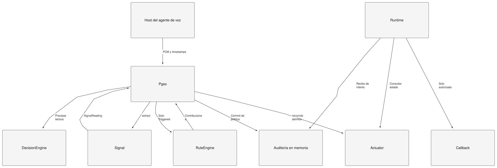

[Fuente LikeC4](likec4/pgso.c4), vista `logic_view`.

Fuentes: [pipeline](../../crates/pgso-core/src/pipeline.rs),
[interfaces](../../crates/pgso-core/src/traits.rs),
[motor](../../crates/pgso-core/src/engine.rs),
[reglas](../../crates/pgso-core/src/rules.rs) y
[runtime](../../crates/pgso-actuator-http/src/runtime.rs).
`apply` sigue existiendo en el trait; el pipeline usa `reconcile` para reemplazar
el conjunto de contribuciones de forma atómica. La configuración, los IDs del
catálogo y los destinos de reglas se validan al construir el pipeline.

### Resultado de observación: no es el estado de la política

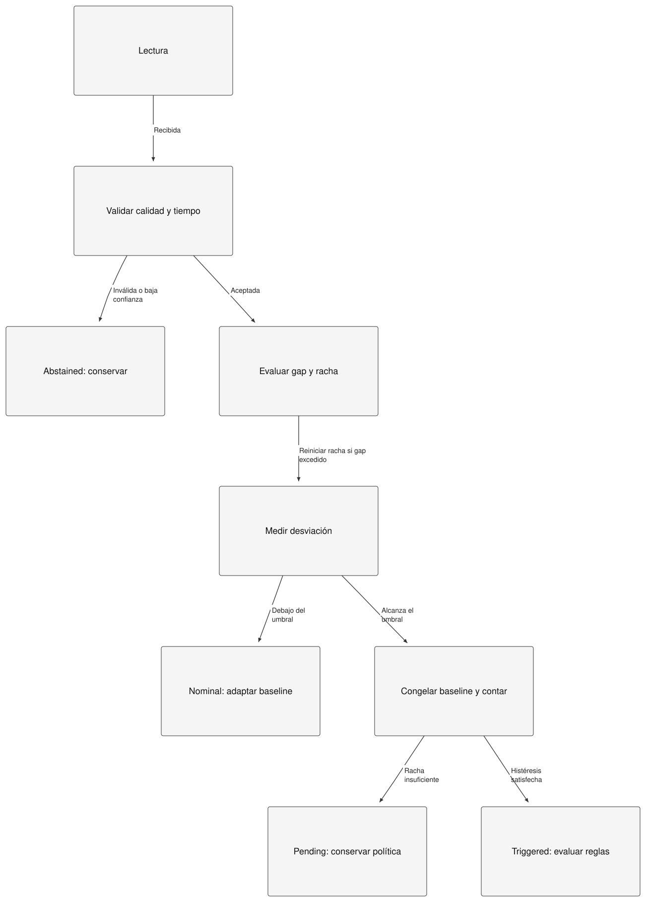

[Fuente LikeC4](likec4/pgso.c4), vista `observation_view`.

Estos son resultados internos `ProcessOutcome`, no cuatro estados persistentes
expuestos por API. `DecisionEngine::process` devuelve `None` para abstención,
nominal y pendiente: ese `None` no permite distinguirlos ni implica recuperación.
Sin lecturas no se ejecuta este flujo. El cambio de lado reinicia la racha; un gap
no concede permisos. La baseline solo se adapta con observaciones nominales.
El bridge experimental fija warmup=0 y EMA=0: no activa adaptación personal.

### Política efectiva: proyección por eje

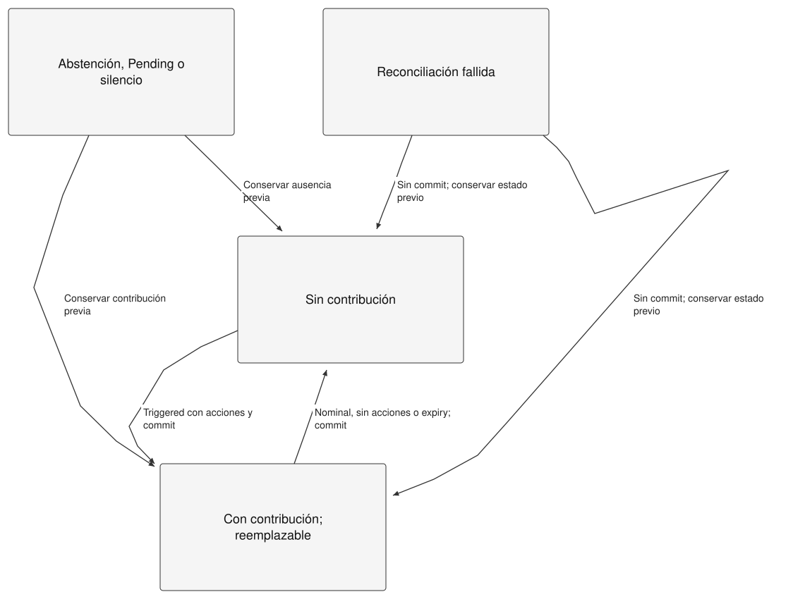

[Fuente LikeC4](likec4/pgso.c4), vista `policy_view`.

Es una proyección del mapa de contribuciones, no un enum literal. Otros ejes
pueden mantener restricciones cuando uno se recupera. Si `reconcile` falla,
la política y el motor staged no se confirman para esa lectura. La extracción
ya pudo cambiar su propio estado; esto no promete rollback de todo el extractor.
Expiry no modifica baseline ni histéresis. Recuperar exposición nunca revierte
un efecto de negocio ni anula permisos independientes del host.
Véase el [contrato temporal](../governance-contract.md).

## 2. Vista de desarrollo

Las flechas siguientes significan **depende de**, no flujo de audio.

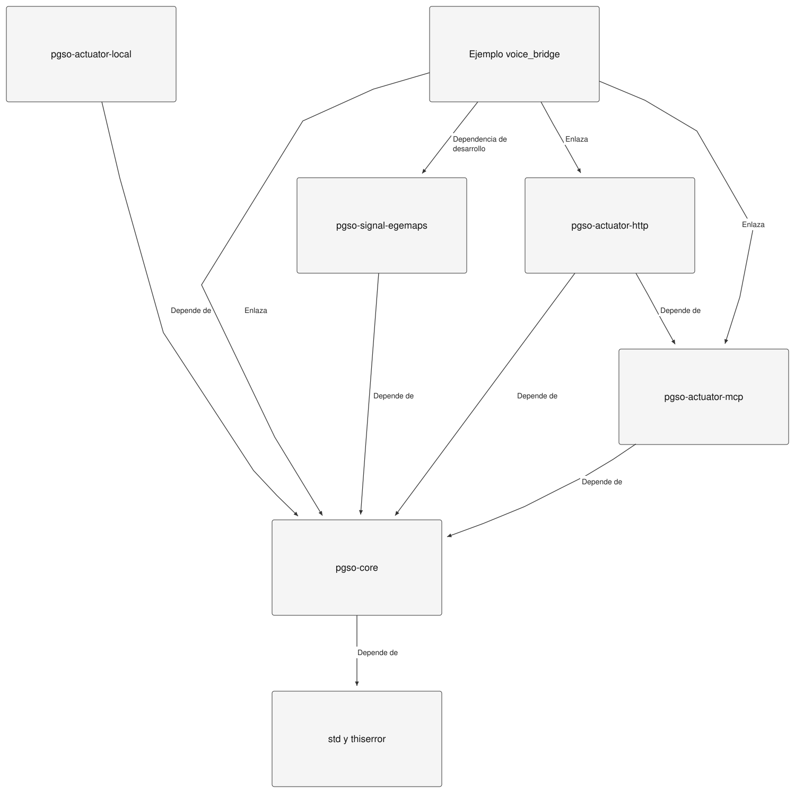

[Fuente LikeC4](likec4/pgso.c4), vista `development_view`.

Los manifests en [crates](../../crates) son la autoridad de dependencias.
La señal se enlaza al ejemplo mediante una dependencia de desarrollo del crate
HTTP; no es dependencia ML obligatoria del núcleo. `pgso-signal-onnx` sigue
planeado, no es un crate implementado del workspace.

| Frontera | Responsabilidad y ubicación |
|---|---|
| SDK reusable | Tipos, contratos, pipeline, motor, reglas y actuadores en `crates/` |
| Bridge experimental | [voice_bridge.rs](../../crates/pgso-actuator-http/examples/voice_bridge.rs): protocolo NDJSON y configuración del piloto |
| Host Python experimental | [bridge.py](../../experiments/public_voice/bridge.py): proceso hijo y callback del entorno |
| Investigación | `experiments/`: no confundir evaluador, fixtures y análisis con API pública |
| Integración Sami | Repositorio externo; `voice_governance.rs` y `canonical_purchase.rs` poseen la integración nativa. No se distribuyen como SDK |

## 3. Vista de procesos y concurrencia

### Runtime HTTP de referencia

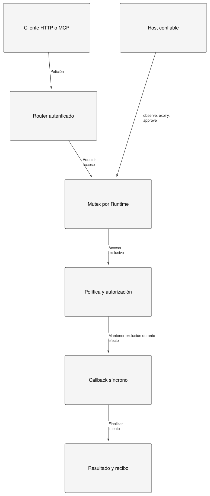

[Fuente LikeC4](likec4/pgso.c4), vista `processes_view`.

El router serializa la sesión durante el callback. Un callback no debe intentar
adquirir su propio runtime. Otras sesiones requieren runtimes separados; no se
promete paralelismo dentro de una sesión ni ejecución distribuida. La captura,
framing y persistencia pertenecen al host. El reloj del núcleo es suministrado;
el runtime HTTP usa su reloj monotónico anclado a UTC. No mezclar dominios de tiempo.
Fuente: [contrato HTTP](../../crates/pgso-actuator-http/README.md).

### Bridge NDJSON: dos procesos, callback en espera

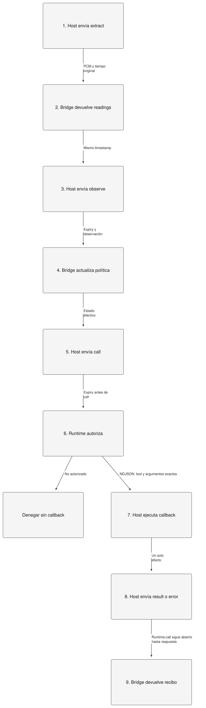

[Fuente LikeC4](likec4/pgso.c4), vista `bridge_view`.

El cliente Python es secuencial. El host nativo de Sami adapta esta espera a su
propietario asíncrono de quote; no convierte el SDK en un runtime asíncrono de
negocio. Un fallo o cancelación no habilita reintento ciego del efecto.
El preflight adicional de Sami quedó aplazado: este diagrama no certifica ese ensayo.

## 4. Vista física: variantes de referencia

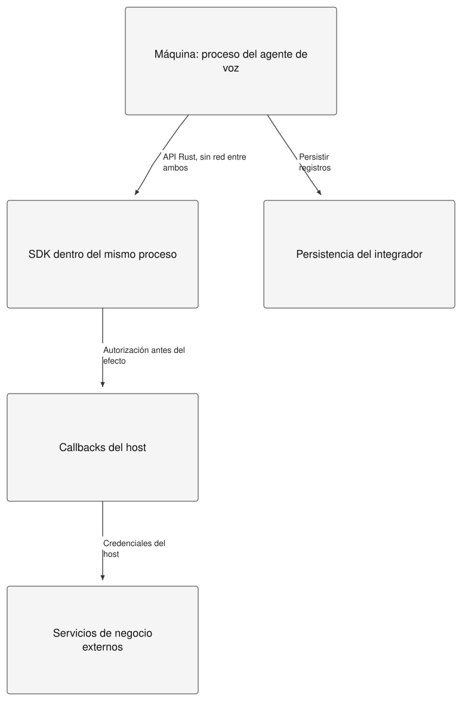

[Fuente LikeC4](likec4/pgso.c4), vista `embedded_view`.

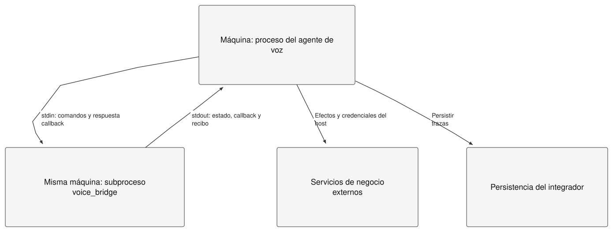

[Fuente LikeC4](likec4/pgso.c4), vista `subprocess_view`.

La variante HTTP del [C4](../pgso-c4.dsl) expone el proceso con router en vez del
canal NDJSON. TLS y límites de tráfico son responsabilidad del despliegue;
Bearer protege las rutas HTTP. No existe endpoint remoto para aprobar ni para
alterar la política. En NDJSON, la frontera de confianza es el host que controla
el proceso, no autenticación HTTP. No se ha dibujado un clúster productivo de Sami:
no se infieren nodos, réplicas, failover o garantías de disponibilidad.

## 5. +1: escenarios que verifican las vistas

### S1–S2: permitir o bloquear aunque el catálogo del cliente esté obsoleto

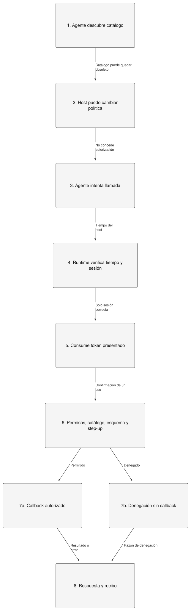

[Fuente LikeC4](likec4/pgso.c4), vista `dispatch_view`.

Las confirmaciones se vinculan a sesión, herramienta, argumentos, revisión y
caducidad; se consumen antes de efectos. Las directivas guían al agente, no son
una frontera de autorización ni garantizan obediencia del modelo.

### S3–S4: abstención, expiración y recuperación

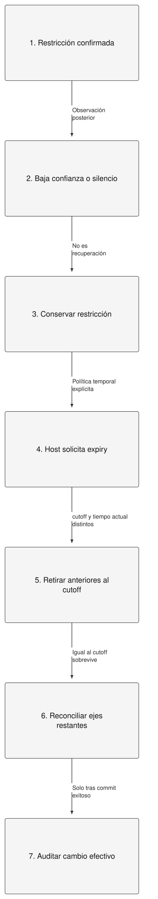

[Fuente LikeC4](likec4/pgso.c4), vista `expiry_view`.

La contribución exactamente en el cutoff sobrevive. Si otros ejes siguen
restringiendo, expirar uno no restaura todo el catálogo. El host debe aplicar
expiry deliberadamente; el núcleo no tiene un temporizador autónomo.

### S5: efecto ejecutado y recibo perdido en el bridge

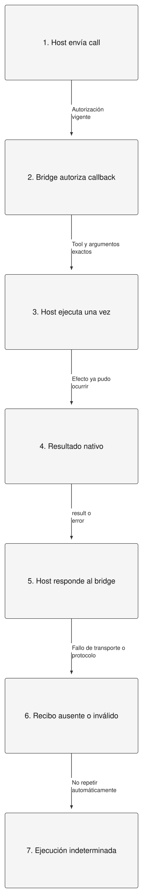

[Fuente LikeC4](likec4/pgso.c4), vista `lost_receipt_view`.

Un fallo después del efecto no lo revierte. El wrapper Python cierra la sesión
ante inconsistencias; el host nativo Sami distingue resultado nativo de recibo
indeterminado. Persistir o reconciliar efectos externos pertenece al integrador.
Los registros del SDK son en memoria, no una bitácora durable ni inviolable.

## Trazabilidad y alcance de la evidencia

| Escenario o contrato | Código | Prueba existente |
|---|---|---|
| S1–S2: dispatch y catálogo obsoleto | [runtime](../../crates/pgso-actuator-http/src/runtime.rs) | `http_and_mcp_share_dispatch_and_do_not_expose_approval`, `stale_discovery_and_confirmation_cannot_bypass_new_restriction` en [execution.rs](../../crates/pgso-actuator-http/tests/execution.rs) |
| Step-up de un uso | Mismo runtime | `confirmations_are_bound_expiring_single_use_and_revocable` en execution.rs |
| S3: abstenerse conserva restricción | [pipeline](../../crates/pgso-core/src/pipeline.rs) | `abstention_after_activation_must_hold_existing_restriction` en [governance_regressions.rs](../../crates/pgso-actuator-mcp/tests/governance_regressions.rs) |
| S4: ejes y expiry | Mismo pipeline | `independent_axis_contributions_survive_recovery_and_expire_explicitly`, `expiry_records_execution_time_separately_from_evidence_cutoff` en governance_regressions.rs |
| Commit fallido | Pipeline y Actuator::reconcile | `failed_reconciliation_does_not_advance_engine_or_commit_policy` en governance_regressions.rs |
| Callback fallido consume aprobación | Runtime::call | `failed_and_panicking_callbacks_consume_confirmation_and_leave_receipts` en execution.rs |
| Bridge y wrapper | [voice_bridge.rs](../../crates/pgso-actuator-http/examples/voice_bridge.rs), [bridge.py](../../experiments/public_voice/bridge.py) | [check_voice_bridge.py](../../crates/pgso-actuator-http/examples/check_voice_bridge.py): PCM sintético, observe, abstención, histéresis, bloqueo y TTL |
| S5: recibo perdido y cancelación nativa | Sami externo: voice_governance.rs / canonical_purchase.rs | Existen pruebas nativas; preflight con nueva candidata aplazado, sin resultado de ese ensayo |

Esta matriz localiza pruebas, no afirma que se hayan vuelto a ejecutar al editar
estos diagramas. Los resultados previos y límites se describen en el
[guion de validación](../validation/live-readiness.md). El
[protocolo del Charter](../validation/charter-validation-protocol.md) separa
validez perceptiva, mecanismo y demostración. Ninguna vista atribuye emoción,
consentimiento o utilidad comercial a una lectura de arousal.

## Formatos y reproducción

No se usa Mermaid en estas vistas. LikeC4 produce el layout y SVG presenta las
proyecciones estáticas. Los flujos numerados representan protocolos y escenarios;
no son diagramas UML de secuencia con escala temporal. Archify presenta el
contexto interactivo en español; sus controles y `html lang` usan el fallback
inglés del visor. El vault se consultó como referencia de formato, sin modificarlo
ni ejecutar sus análisis.


Para regenerar con herramientas previamente instaladas (LikeC4 1.59.4 y Archify
2.17.0-dev.1 usadas en esta revisión):

```sh
likec4 validate docs/architecture/likec4
likec4 export json --pretty -o docs/architecture/likec4/model.json docs/architecture/likec4
python3 docs/architecture/render_likec4.py
# Desde la instalación de Archify, usando rutas absolutas al SDK:
# node bin/archify.mjs deliver architecture <context.json> <context.html> --quality showcase --json
```

`render_likec4.py` conserva las coordenadas del layout y el estilo SVG neutro
usado en el vault. Comprueba XML, vistas no vacías y altura del texto en nodos;
no sustituye la inspección visual. El JSON de layout es generado: editar `.c4`,
no sus coordenadas. Los SVG de escenarios usan pasos numerados y alternativas.

Validación de esta entrega: [registro](validation.json), [comprobación del visor](views/context.visual-check.json). Las verificaciones documentales no son nuevos resultados del SDK.
