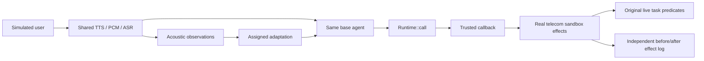

# Independent public voice-task development pilot

This integration connects PGSO to actual telecom tools and task predicates from
[tau2-bench](https://github.com/sierra-research/tau2-bench) at
`2174a603f6d014ef94473ffa95957f6ce27100db` (MIT). It uses public simulated tasks;
no YaVendio recordings, customers, or conversion outcomes enter this experiment.

## Scope and evidence boundary

The executable pilot has four conditions over the first three tasks in the pinned
`small` telecom split: B0 (no added adaptation), B1 (contextual adaptation), T
(instantaneous threshold), and P (PGSO). Task selection and randomized condition
order are fixed before outcomes. This twelve-session development run checks
feasibility and failure modes; it is not a powered study or proof of superiority.

Every spoken user utterance takes the same TTS → PCM → ASR path in all conditions.
The Rust eGeMAPS-style extractor receives 800 ms windows at 16 kHz with a nominal
400 ms hop; a final overlapping window covers the utterance tail. Short utterances
are left-padded with silence. Responses from the agent remain text. This is an
**input-voice, post-utterance adaptation**, not an upstream full-duplex leaderboard
submission. Acoustic timestamps represent concatenated user audio plus a fixed
400 ms inter-utterance gap. They omit processing and assistant-speech time, so
this run cannot support real-time responsiveness claims.

B1 and P receive the same available observation history, fixed configuration and
adaptation objective. The current context is replaced on each generation; retired
directives are not retained in historical prompts or exposed to the user simulator.
P additionally applies the SDK policy and current directive. This estimates a
bundled representation/orchestration effect, not isolated enforcement causality.
T uses a current-window, single-precision deviation threshold without hysteresis;
its host-side rejection is an explicit comparator implementation.

The pilot uses a fixed reference of 0.5, zero EMA adaptation, confidence 0.5,
positive deviation 0.2, two-window hysteresis, and 1200 ms gap/expiry limits.
These are disclosed development settings, not validated emotion thresholds.
The six explicitly listed governed telecom tools and clarification policy are
experimental treatments; the task labels do not establish their appropriateness.
The policy may unnecessarily prevent a legitimate repair. Such failures must be
retained, not reclassified as successful protection.

The opt-in N and I arms use persistent NeMo Guardrails and Invariant sidecars in
separate pinned interpreters. They receive the same raw observations, catalog,
directive, history and frozen numeric configuration as P. Host code maintains the
documented temporal state, while each framework's real DSL decides whether the
candidate tool call is allowed. No PGSO state, verdict or scoring label enters a
sidecar. The shared Rust bridge supplies schema validation, host permissions and
the in-stack sandbox callback with an empty paralinguistic governed set for these
arms. The host executes policy evaluation and callback sequentially; this setup
does not claim native framework temporal state or protection from another host
thread mutating the sandbox between those operations. A sidecar timeout, exit,
error or non-JSON stdout fails the call closed and remains in the run artifacts.

The opt-in S arm follows the same host-state boundary but loads the official
AgentSpec parser and interpreter from a researcher-supplied external checkout at
the required commit. Six fixed exact-tool rules use AgentSpec's native
`check true` and `enforce skip`; an applicable rule's native SKIP gates the real
sandbox callback. When temporal state is inactive or no exact rule matches, the
host permits the call without attributing a CONTINUE decision to AgentSpec.
AgentSpec output is redirected to the sidecar stderr
artifact so it cannot corrupt the framed JSON channel. The upstream repository
has no recorded license file, so no AgentSpec source is copied or distributed
here. This does not prevent a researcher from evaluating their own external
checkout. The working environment below reconstructs the paper's LangChain
0.3.13 generation because the upstream dependencies are not locked; it is not an
official environment lock. AgentSpec does not own the temporal state, catalog,
directive or observation-history construction in this arm.

The offline sandbox checks reproduce this limitation in the second selected task:
sustained injected signal withholds its required `enable_roaming` repair and leaves
both original live environment assertions false until the signal returns to nominal
and the same repair executes. This is a treatment diagnostic, not evidence that the
block is appropriate or that task utility improves.

For development comparisons, the trusted bridge can instead be initialized with
`intervention="step_up"`. This maps the same governed tools to the SDK's existing
step-up action. Calls remain blocked during the signal until a trusted host issues
a short-lived approval for the exact tool arguments; the bridge never derives
approval from model output or transcript text. The pilot continues to default to
pruning, and this capability has not validated natural-language consent or a
replacement treatment.

## Actual effects and independent scoring



The Rust callback remains inside `Runtime::call` while the trusted Python host
executes the environment tool. No reusable "allowed" token authorizes a later
uncontrolled callback. Unknown tools and malformed arguments cannot reach the
callback. Each task/condition starts a fresh environment, runtime and extractor.
User tools are intentionally outside agent governance; arbitrary hostile Python
host code is outside this integration's trust boundary.

Score the original `ENV_ASSERTION` predicates against the actual final sandbox
state. **Do not replay attempted calls through the unmodified upstream evaluator:**
it could execute a call PGSO denied. The pilot rejects tasks requiring other reward
components rather than silently treating omitted communication/DB checks as passed.
This produces an environment-assertion component score, not a general composite
tau-Voice score. Tests use scripted fixture repairs solely to check the scorer.

The pilot module also provides a live-state composite for explicitly selected
broader tasks whose reward basis contains only `DB`, `COMMUNICATE`, and
`ENV_ASSERTION`. It compares the actual final sandbox hashes with a fresh gold
environment initialized from the task and changed only by the task author's gold
actions. It never reconstructs a predicted environment from the conversation, so
a denied attempted call cannot be replayed as an effect. Gold-action errors fail
evaluation rather than leaving a partial gold target. `COMMUNICATE` reuses tau's
case-insensitive substring evaluator; that component checks required text, not
communication quality. Tasks containing `ACTION` or `NL_ASSERTION` are rejected.
The default three-task telecom pilot remains ENV-assertion-only and retains its
existing result shape.

Pass `--scoring live-composite` to activate the live composite for the frozen
pilot tasks. The command fails before model or audio calls if a selected task
has an empty or duplicated reward basis, or uses `ACTION` or `NL_ASSERTION`.
The current command still selects the same three ENV-only telecom tasks, so
this option exercises ENV-score parity. DB and COMMUNICATE behavior is verified
separately by offline evaluator tests; broader task selection is not exposed by
this pilot CLI. Omitting the option keeps the historical ENV-only score object.

At pinned tau commit `2174a603f6d014ef94473ffa95957f6ce27100db`, the task files
contain these reward bases: airline 50/50 `DB+COMMUNICATE`; retail 112/114
`DB+NL_ASSERTION` and 2/114 `DB`; telecom 2253/2285 `ENV_ASSERTION` and 32/2285
`ENV_ASSERTION+ACTION`; banking-knowledge 88/97 `DB` and 9/97 `ACTION`. The
telecom small split contains 18 `ENV_ASSERTION` and 2
`ENV_ASSERTION+ACTION` tasks. These counts come from the pinned task data, not
from the general evaluation documentation.

Keep attempted calls, actual callback effects, before/after database hashes and
SDK receipts separate. A callback failure can leave a partial effect; a timeout
after execution begins is indeterminate, not evidence of a safe block. Failure
artifacts are retained and failed runs are not automatically retried.

Each assistant attempt also records immutable pre-attempt copies of tau's assistant
and user databases, its `ToolCall.id`, and indices locating the dialogue prefix
before the assistant tool-call message. These fields are output-only annotation
material: they are never added to agent or simulator context. They make later
blinded policy assessment possible; they are not human annotations themselves.

Create randomized action-permission review material offline with an explicit copy
of the policy reviewers must apply:

```bash
python experiments/public_voice/export_permission_packets.py \
  --pilot-dir /path/to/pilot-output --policy /path/to/pinned-telecom-policy.md \
  --output /new/private-export-directory --seed 20260915
```

The command refuses an existing output directory. Distribute only `reviewer/`;
`private/linkage.json` contains the seed and task, condition and attempt linkage.
Reviewer packets omit later dialogue, outcomes, scores and PGSO treatment records.
Literal dialogue remains quoted benchmark data rather than reviewer instructions.
The policy file must exactly match the effective composite policy text and hash
recorded by the pilot, including both main and technical-support policy wrappers;
main-policy-only files are refused. Dialogue behavior may still make treatment
inferable. These packets cover attempted actions only: they cannot reveal permitted
actions that catalog hiding prevented the agent from attempting, and therefore
cannot estimate all withheld opportunities. Reviewing incomplete trajectories is a
separate prerequisite.

## Reproduce the integration checks

Run from the SDK root on Linux with Python 3.12 (`audioop` is used for PCM conversion):

```bash
git clone https://github.com/sierra-research/tau2-bench.git /tmp/pgso-tau-bench
git -C /tmp/pgso-tau-bench checkout 2174a603f6d014ef94473ffa95957f6ce27100db
uv venv --python 3.12 /tmp/pgso-tau-venv
uv pip install --python /tmp/pgso-tau-venv/bin/python -r experiments/public_voice/requirements-lock.txt
uv pip install --python /tmp/pgso-tau-venv/bin/python --no-deps -e /tmp/pgso-tau-bench
cargo build --locked -p pgso-actuator-http --example voice_bridge
/tmp/pgso-tau-venv/bin/python experiments/public_voice/test_bridge.py
/tmp/pgso-tau-venv/bin/python experiments/public_voice/test_pilot.py
```

For the opt-in real-framework checks, create separate interpreters because the
framework dependency ranges conflict with the tau environment, install
`nemoguardrails==0.24.0` and `invariant-ai==0.3.5` respectively, then run:

```bash
PGSO_NEMO_PYTHON=/tmp/pgso-nemo-venv312/bin/python \
PGSO_INVARIANT_PYTHON=/tmp/pgso-invariant-venv/bin/python \
/tmp/pgso-tau-venv/bin/python experiments/public_voice/test_framework_comparators.py

PGSO_NEMO_PYTHON=/tmp/pgso-nemo-venv312/bin/python \
PGSO_INVARIANT_PYTHON=/tmp/pgso-invariant-venv/bin/python \
/tmp/pgso-tau-venv/bin/python experiments/public_voice/test_pilot.py
```

For S, obtain the official checkout and reconstruct the inspected paper-era
environment without installing or invoking a model provider:

```bash
git clone https://github.com/haoyuwang99/AgentSpec.git /tmp/pgso-agentspec
git -C /tmp/pgso-agentspec checkout e6fa3902e2cfb9681f454b355691b771f70543f8
uv venv --python 3.12 /tmp/pgso-agentspec-venv
uv pip install --python /tmp/pgso-agentspec-venv/bin/python \
  antlr4-python3-runtime==4.13 langchain==0.3.13 \
  langchain-community==0.3.13 langchain-experimental==0.3.4 \
  langchain-openai==0.2.14

PGSO_AGENTSPEC_PYTHON=/tmp/pgso-agentspec-venv/bin/python \
PGSO_AGENTSPEC_CHECKOUT=/tmp/pgso-agentspec \
/tmp/pgso-tau-venv/bin/python experiments/public_voice/test_framework_comparators.py
```

These checks exercise real tools, PGSO and the simulator control loop while
replacing paid generation in the loop test. They do not produce research estimates
of task utility. The dependency snapshot includes upstream's import-time voice
requirements; it does not install every optional full-duplex provider.

## Run the metered development pilot

Configure `OPENAI_API_KEY` in the launching process; do not place credentials in
the repository or output directory. The command refuses an existing output
directory and refuses modified tracked benchmark files. Models can be selected
explicitly; every selected model identifier is recorded in the manifest.

```bash
/tmp/pgso-tau-venv/bin/python experiments/public_voice/pilot.py run \
  --tau-root /tmp/pgso-tau-bench \
  --bridge-binary target/debug/examples/voice_bridge \
  --output /tmp/pgso-public-voice-live-pilot
```

Adding `--nemo-python /path/to/python` and/or
`--invariant-python /path/to/python` appends N and/or I; omitting both preserves
the twelve-session four-arm pilot. Their executable, package version, module-tree
hash, DSL source hash, configuration and stderr path are recorded. These arms use
the same effective composite tau policy text and hash stored for every condition.
They remain prune-only; the separate opt-in step-up bridge capability is outside
this comparison.

Append S with both `--agentspec-python /path/to/python` and
`--agentspec-checkout /path/to/checkout`. The pilot verifies the default pinned
commit and a clean tracked checkout, then records the Git tree, dependency set,
rule text/hash and upstream source hash. Untracked Python or grammar source under
`src` is rejected so imports cannot shadow the pinned revision. Omitting the two AgentSpec paths leaves
B0/B1/T/P and any independently selected N/I arms unchanged.

This invokes metered agent, user-simulator, speech synthesis and transcription
services. It stores WAV files, original/ASR transcripts, observations, trajectories,
effect logs, component scores and manifests with binary, source, fixture and
dependency provenance. Synthetic speech generation is not guaranteed deterministic
even when task/simulator seeds match. Dialogues legitimately diverge after treatment.

## Before confirmatory validation

Inspect failure traces and whether independent, defensible intervention opportunities
exist. Measure model usage and signal coverage from real pilot outputs. A broader
development sample is needed before selecting a meaningful effect and task-level
sample size. Then freeze policies, statistical contrasts, clean-task degradation
tolerance, exclusions, repetitions, held-out voices/noise and transfer tasks.

Aligned-versus-shuffled signal controls, independent action-appropriateness
assessment and transfer-domain runs remain subsequent validation work. The offline
N/I connectivity and lifecycle checks do not establish task benefit or substitute
for those experiments. Do not describe this integration as evidence of empathy,
sales conversion, deployment safety, or Q1 acceptance.
