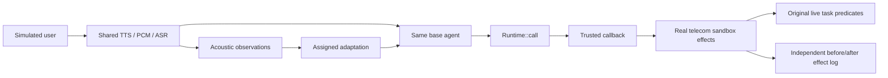

# Independent public voice-task development pilot

This integration connects PGSO to actual telecom tools and task predicates from
[tau2-bench](https://github.com/sierra-research/tau2-bench) at
`2174a603f6d014ef94473ffa95957f6ce27100db` (MIT). It uses public simulated tasks;
no YaVendio recordings, customers, or conversion outcomes enter this experiment.

## Scope and evidence boundary

The executable pilot has four conditions over the first three tasks in the pinned
`small` telecom split: B0 (no added adaptation), B1 (contextual adaptation), T
(instantaneous threshold), and P (PGSO). Task selection and randomized condition
order are fixed before outcomes. This twelve-session development run checks
feasibility and failure modes; it is not a powered study or proof of superiority.

Every spoken user utterance takes the same TTS → PCM → ASR path in all conditions.
The Rust eGeMAPS-style extractor receives 800 ms windows at 16 kHz with a nominal
400 ms hop; a final overlapping window covers the utterance tail. Short utterances
are left-padded with silence. Responses from the agent remain text. This is an
**input-voice, post-utterance adaptation**, not an upstream full-duplex leaderboard
submission. Acoustic timestamps represent concatenated user audio plus a fixed
400 ms inter-utterance gap. They omit processing and assistant-speech time, so
this run cannot support real-time responsiveness claims.

B1 and P receive the same available observation history, fixed configuration and
adaptation objective. The current context is replaced on each generation; retired
directives are not retained in historical prompts or exposed to the user simulator.
P additionally applies the SDK policy and current directive. This estimates a
bundled representation/orchestration effect, not isolated enforcement causality.
T uses a current-window, single-precision deviation threshold without hysteresis;
its host-side rejection is an explicit comparator implementation.

The pilot uses a fixed reference of 0.5, zero EMA adaptation, confidence 0.5,
positive deviation 0.2, two-window hysteresis, and 1200 ms gap/expiry limits.
These are disclosed development settings, not validated emotion thresholds.
The six explicitly listed governed telecom tools and clarification policy are
experimental treatments; the task labels do not establish their appropriateness.
The policy may unnecessarily prevent a legitimate repair. Such failures must be
retained, not reclassified as successful protection.

The offline sandbox checks reproduce this limitation in the second selected task:
sustained injected signal withholds its required `enable_roaming` repair and leaves
both original live environment assertions false until the signal returns to nominal
and the same repair executes. This is a treatment diagnostic, not evidence that the
block is appropriate or that task utility improves.

For development comparisons, the trusted bridge can instead be initialized with
`intervention="step_up"`. This maps the same governed tools to the SDK's existing
step-up action. Calls remain blocked during the signal until a trusted host issues
a short-lived approval for the exact tool arguments; the bridge never derives
approval from model output or transcript text. The pilot continues to default to
pruning, and this capability has not validated natural-language consent or a
replacement treatment.

## Actual effects and independent scoring



The Rust callback remains inside `Runtime::call` while the trusted Python host
executes the environment tool. No reusable "allowed" token authorizes a later
uncontrolled callback. Unknown tools and malformed arguments cannot reach the
callback. Each task/condition starts a fresh environment, runtime and extractor.
User tools are intentionally outside agent governance; arbitrary hostile Python
host code is outside this integration's trust boundary.

Score the original `ENV_ASSERTION` predicates against the actual final sandbox
state. **Do not replay attempted calls through the unmodified upstream evaluator:**
it could execute a call PGSO denied. The pilot rejects tasks requiring other reward
components rather than silently treating omitted communication/DB checks as passed.
This produces an environment-assertion component score, not a general composite
tau-Voice score. Tests use scripted fixture repairs solely to check the scorer.

Keep attempted calls, actual callback effects, before/after database hashes and
SDK receipts separate. A callback failure can leave a partial effect; a timeout
after execution begins is indeterminate, not evidence of a safe block. Failure
artifacts are retained and failed runs are not automatically retried.

## Reproduce the integration checks

Run from the SDK root on Linux with Python 3.12 (`audioop` is used for PCM conversion):

```bash
git clone https://github.com/sierra-research/tau2-bench.git /tmp/pgso-tau-bench
git -C /tmp/pgso-tau-bench checkout 2174a603f6d014ef94473ffa95957f6ce27100db
uv venv --python 3.12 /tmp/pgso-tau-venv
uv pip install --python /tmp/pgso-tau-venv/bin/python -r experiments/public_voice/requirements-lock.txt
uv pip install --python /tmp/pgso-tau-venv/bin/python --no-deps -e /tmp/pgso-tau-bench
cargo build --locked -p pgso-actuator-http --example voice_bridge
/tmp/pgso-tau-venv/bin/python experiments/public_voice/test_bridge.py
/tmp/pgso-tau-venv/bin/python experiments/public_voice/test_pilot.py
```

These checks exercise real tools, PGSO and the simulator control loop while
replacing paid generation in the loop test. They do not produce research estimates
of task utility. The dependency snapshot includes upstream's import-time voice
requirements; it does not install every optional full-duplex provider.

## Run the metered development pilot

Configure `OPENAI_API_KEY` in the launching process; do not place credentials in
the repository or output directory. The command refuses an existing output
directory and refuses modified tracked benchmark files. Models can be selected
explicitly; every selected model identifier is recorded in the manifest.

```bash
/tmp/pgso-tau-venv/bin/python experiments/public_voice/pilot.py run \
  --tau-root /tmp/pgso-tau-bench \
  --bridge-binary target/debug/examples/voice_bridge \
  --output /tmp/pgso-public-voice-live-pilot
```

This invokes metered agent, user-simulator, speech synthesis and transcription
services. It stores WAV files, original/ASR transcripts, observations, trajectories,
effect logs, component scores and manifests with binary, source, fixture and
dependency provenance. Synthetic speech generation is not guaranteed deterministic
even when task/simulator seeds match. Dialogues legitimately diverge after treatment.

## Before confirmatory validation

Inspect failure traces and whether independent, defensible intervention opportunities
exist. Measure model usage and signal coverage from real pilot outputs. A broader
development sample is needed before selecting a meaningful effect and task-level
sample size. Then freeze policies, statistical contrasts, clean-task degradation
tolerance, exclusions, repetitions, held-out voices/noise and transfer tasks.

Matched NeMo/Invariant task-level implementations, aligned-versus-shuffled signal
controls, independent action-appropriateness assessment and transfer-domain runs
remain subsequent validation work. Existing lifecycle parity tests do not substitute
for these experiments. Do not describe this integration as evidence of empathy,
sales conversion, deployment safety, or Q1 acceptance.
